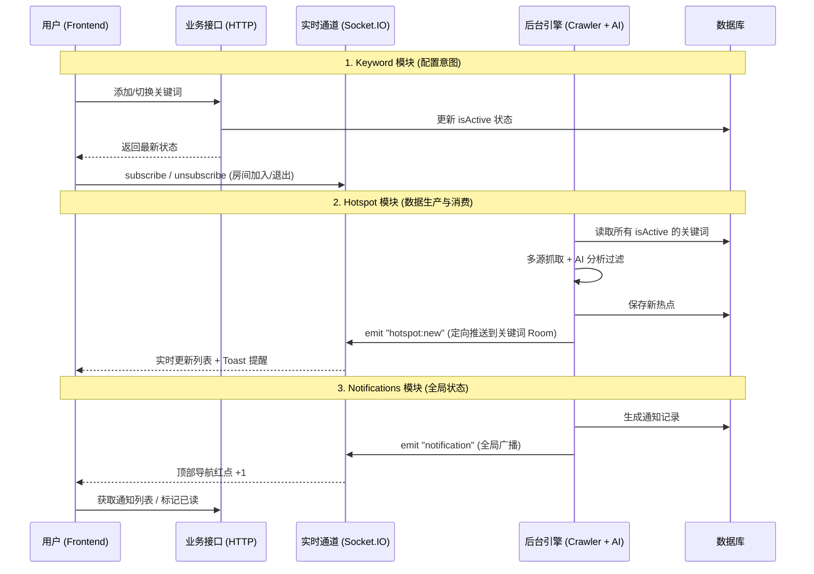

# 系统架构与通信机制概解 (Communication Architecture)

本文档总结了本项目中 **HTTP 业务接口** 与 **WebSocket 实时通道** 协同工作的核心设计哲学与全景流程。

## 1. 业务流程全景图 (Sequence Diagram)

## 2. 核心设计哲学：HTTP vs WebSocket

项目采用了“指令-反馈”分离的异步架构，以应对爬虫和 AI 分析的高延迟特性：

| 场景类型 | 选用协议 | 逻辑说明 |
| :--- | :--- | :--- |
| **状态/配置变更** | **HTTP** | 确保操作的**原子性**与**确定性**。配置必须先入库（DB）才算成功。 |
| **长耗时任务反馈** | **WebSocket** | AI 抓取可能需要 15s-1min。WS 允许后端在任务完成后“找”用户，避免 HTTP 超时。 |
| **异步自动推送** | **WebSocket** | 针对每 30 分钟一次的 **Cron Job** 自动运行结果，WS 是唯一的实时触达手段。 |
| **精准流量控制** | **WS Room** | 将“谁该看什么”的过滤在服务端完成，节省客户端流量。 |

## 3. 模块详细说明

关于各模块内部的具体实现细节，请参阅：

* [Keyword 模块逻辑 (房间订阅机制)](./LOGIC_KEYWORD.md)
* [Hotspot 模块逻辑 (数据流式消费)](./LOGIC_HOTSPOT.md)
* [Notifications 模块逻辑 (全局感知系统)](./LOGIC_NOTIFICATIONS.md)

## 4. 关键洞察：为什么要“多此一举”做 Room 订阅？

即使在单用户场景下，采用基于 Room 的订阅模式也有以下核心价值：

1. **标签页隔离**：防止用户在搜索旧数据时收到无关词的实时干扰。
2. **异步同步化**：通过前端手动触达 `unsubscribe`，确保界面在关闭开关那一刻起，立刻隔绝管道中残留的异步推送。
3. **平滑扩展**：为未来可能的分布式、多用户或多频道功能预留了完整的架构支持。
